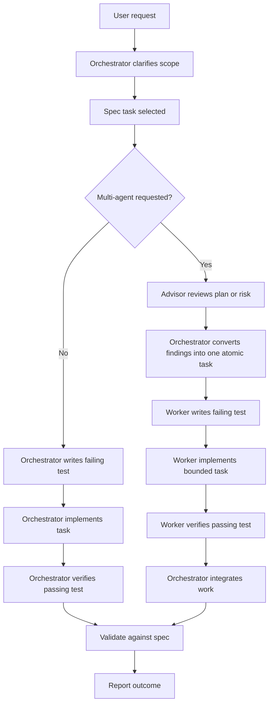

# AGENTS.md

## Project Identity

Spritey is a Go CLI for generating animated 2D character spritesheets from recipe files and compatible assets.

The command name is `spritey`.

Legacy prototypes may exist locally in ignored directories such as `python_source/`, but those directories must not be committed. Use them only as local behavioral references when present.

## Root Layout

The repository root is this folder:

```text
spritey/
```

The Go implementation lives at the repository root. Do not place the Go app inside `python_source/`.

The optional local legacy prototype snapshot may live at:

```text
python_source/
```

Use `assets` as the user-facing term for compatible asset packs.

## Development Workflow

Spritey uses Spec Kit-style spec-driven development.

Reference the official GitHub Spec Kit project when applying the workflow:

```text
https://github.com/github/spec-kit
```

Prefer this flow for feature work:

```text
constitution -> feature spec -> technical plan -> tasks -> implementation -> validation
```

Implementation tasks should use TDD when practical:

```text
spec task -> failing test -> minimal implementation -> passing test -> refactor -> validation
```

For CLI behavior, schema validation, recipe parsing, catalog output, reports, and rendering logic, write or update the relevant test before implementing the behavior. Docs-only, exploratory, and repo-maintenance tasks may skip TDD when a test would not add useful signal.

Do not implement substantial behavior before the relevant spec/task exists unless the user explicitly asks for a quick prototype or repo maintenance change.

## LLM Wiki Workflow

Use the `llm-wiki` / `@wiki` skill for project knowledge-base work.

This repository has a project-local wiki at:

```text
.wiki/
```

Use the local wiki when the user asks to ingest, query, audit, lint, compile, document project knowledge, or recover context about Spritey decisions.

Before broad repo analysis, prefer reading:

```text
.wiki/_index.md
.wiki/wiki/_index.md
.wiki/raw/_index.md
```

Keep `.wiki/` updated when project-level decisions, architecture rules, CLI contracts, specs, or reference-implementation findings change. Raw sources belong under `.wiki/raw/`; synthesized knowledge belongs under `.wiki/wiki/`.

Do not use the wiki as a replacement for live verification. If current repo state matters, inspect the files directly and then update the wiki if the knowledge changed.

## Multi-Agent Workflow Enforcement

If the user prompts for multi-agent workflow, subagents, parallel agents, background workers, or delegated agent work, the main agent must act as the orchestrator.

Use these roles:

- Orchestrator: the main agent. Owns scope, sequencing, integration, and final validation.
- Advisor: read-only subagent. Reviews specs, architecture, risks, or implementation plans.
- Worker: implementation subagent. Performs one bounded code or documentation task.

When using the multi-agent workflow, run the Advisor finding step before assigning Worker implementation. The Orchestrator should convert Advisor findings into a bounded Worker task.

Each subagent task must be atomic.

Aim for one spec task per subagent task. Do not give a subagent broad ownership such as "build the CLI". Instead, assign a single task such as "implement recipe JSON loading" or "review the pack defaults spec".

Workers are not alone in the codebase. Tell them not to revert unrelated changes and to keep edits within their assigned files or module.

Simple flow:



## Architecture Style

Follow a Rails-style MVC organization adapted for a Go CLI.

Use clear responsibility boundaries:

- Models: domain data and validation rules.
- Controllers: command handlers and request orchestration.
- Views: user-facing and machine-facing output formatting.
- Services: reusable business operations such as rendering, catalog loading, palette resolution, and report generation.

Preferred folder structure:

```text
spritey/
  cmd/
    spritey/
      main.go
  app/
    controllers/
    models/
    views/
    services/
  config/
  docs/
    spec/
  schemas/
  testdata/
```

Keep CLI parsing thin. Command handlers should delegate to controllers/services instead of embedding business logic in `main.go`.

## Spritey Product Flow

Keep the product flow agent-friendly:

```bash
spritey catalog --assets ./assets --json
spritey inspect layer <layer-id> --assets ./assets --json
spritey validate recipe.json --assets ./assets --json
spritey make recipe.json --assets ./assets --out output/sprite.png --report output/sprite.report.json
```

Inputs should be file-based where practical. Inline JSON must not be the primary workflow.

Outputs should be explicit and predictable. JSON modes and reports must remain stable enough for agents and scripts to parse.

## Asset Pack Rules

A compatible assets directory should support:

```text
assets/
  pack.json
  sheet_definitions/
  spritesheets/
  palette_definitions/
```

`pack.json` owns pack-level defaults, including body type, animation list, canvas width, palette fallback rules, and missing body-type fallback behavior.

Spritey should not hardcode behavior that belongs to the asset pack unless the fallback is explicitly documented in a spec.

Do not commit third-party sprite assets. Asset packs are user-downloaded, installed, or provided at runtime.

## Testing Standard

Use automated tests for behavior that affects the CLI contract or rendering output.

Preferred validation:

- JSON Schema for pack, recipe, report, and catalog contracts.
- Fixture asset packs in `testdata/`.
- Golden JSON outputs for stable command responses.
- Image dimension checks.
- Pixel or hash checks where deterministic.
- CLI command tests for user-facing behavior.

## Guardrails

Do not treat `python_source/` as the Go app root, and do not commit it.

Do not rename Spritey commands, folders, or user-facing terms without updating the relevant spec.

Do not add GUI/editor scope, marketplace behavior, or broad plugin systems before the Go CLI matches the agreed core generation behavior.
